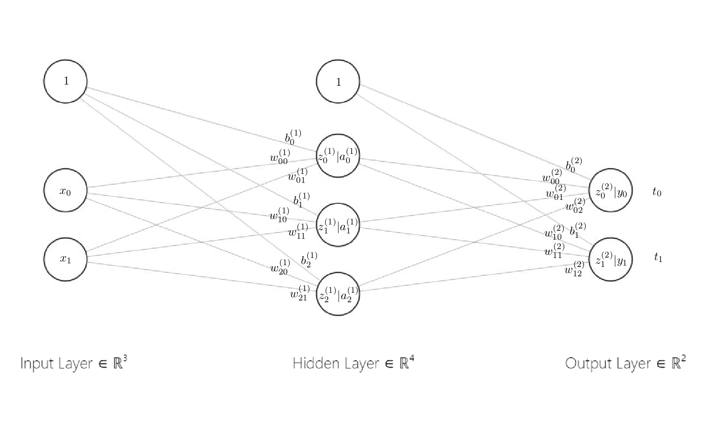
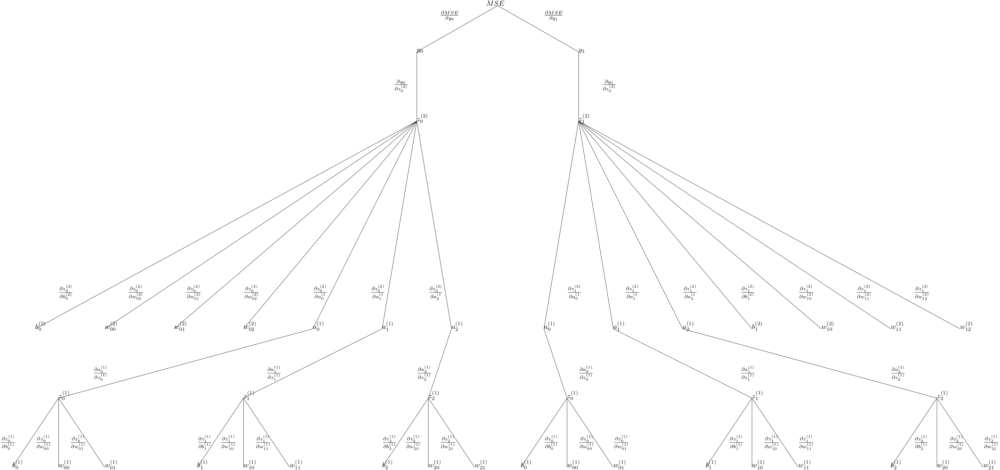

# Backpropagation calculations

🔥All hand calculations for the #Backpropagation algorithm!🔥

...I've also created a chain rule tree diagram for a primary Neural Network. 🔎

Backpropagation is a standard method for training a Neural Network. With this notebook, my attempt is to explain how it works with an explicit example.

Following the rundown of the calculations, step-by-step implementation and finally the construction of the Neural Network from scratch.

Try out and learn how it works here.

## Setup
* `git clone https://github.com/okamiRvS/Backpropagation.git`
* `pip install -r requirements.txt`